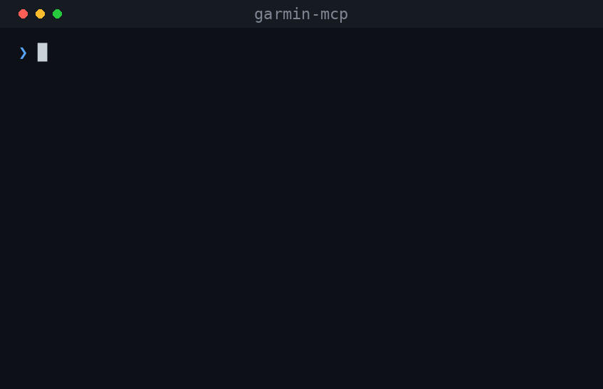

# garmin-mcp

[](https://pypi.org/project/garmin-mcp/) [](https://pypi.org/project/garmin-mcp/) [](LICENSE)

An [MCP](https://modelcontextprotocol.io/) server that exposes your Garmin Connect data to Claude as tools. Ask things like *"how did I sleep last night?"* or *"summarise my training load this week"* and Claude answers using your real Garmin data instead of you copy-pasting screenshots from the app.

<p align="center">
  
</p>

<sub>Demo uses sample data. Regenerate with <code>uv run --with pillow python scripts/make_demo_gif.py</code>.</sub>

Single-user, and read-only by default — with one **opt-in** write path for creating strength workouts (see [Write tools](#write-tools-opt-in)). Two ways to run it:

| Mode                 | Where it runs           | Works with                       | Setup            |
| -------------------- | ----------------------- | -------------------------------- | ---------------- |
| **Local (stdio)**    | Your own machine        | Claude Desktop                   | One command      |
| **Self-hosted HTTP** | Cloud Run (or anywhere) | Claude.ai web, mobile, Desktop   | ~10 min, ~$0/mo  |

## Tools

| Tool                       | What it returns                                                              |
| -------------------------- | ---------------------------------------------------------------------------- |
| `get_daily_briefing`       | **One-call morning snapshot** — fuses sleep, HRV, Body Battery, readiness, training load, and resting HR (plus RHR vs. your baseline) so Claude can reason across them in a single shot. Each section degrades to `null` if unavailable. |
| `get_sleep`                | Sleep duration, stages (deep / light / REM / awake), score, overnight HRV.   |
| `get_recent_activities`    | List of recent activities with type, duration, distance, average heart rate. |
| `get_activity_details`     | Full metrics for one activity, including splits, HR zones, and power.        |
| `get_training_load`        | Daily training load with acute (ATL), chronic (CTL), and current status.     |
| `get_training_readiness`   | Daily readiness score 0-100 with contributing factors (sleep, HRV, recovery).|
| `get_hrv_status`           | Current HRV status, baseline range, and the last 7 nights of readings.       |
| `get_body_battery`         | Body battery values across the day with min, max, charged, drained.          |
| `get_steps_and_calories`   | Daily step count, distance, calories, floors, and intensity minutes.         |
| `get_resting_heart_rate`   | Resting heart rate trend and average over the requested window.              |
| `get_stress`               | Stress levels across the day and time-in-zone breakdown.                     |
| `get_respiration`          | Daily respiration rate: average, min, max, sleep vs waking.                  |
| `get_fitness_metrics`      | VO2 max (running/cycling), fitness age, and predicted 5K/10K/half/marathon.  |
| `get_personal_records`     | Personal records across activity types (fastest 1K/5K, longest run, etc.).   |
| `get_body_composition`     | Weight, body fat, and muscle-mass trend over recent days.                    |
| `get_weekly_summary`       | Weekly aggregates for steps, stress, or intensity minutes.                   |

Every response is a Pydantic model serialised to JSON, with `null` for fields Garmin did not record.

### Write tools (opt-in)

These **create** data in your Garmin account and are disabled unless you set `GARMIN_WRITE_ENABLED=1`. All other tools stay read-only regardless.

| Tool                        | What it does                                                                  |
| --------------------------- | ----------------------------------------------------------------------------- |
| `preview_strength_workout`  | Assembles a strength workout and shows the resolved Garmin exercises, per-exercise confidence, warnings, and a confirmation token. **Makes no network call.** |
| `create_strength_workout`   | Creates the workout in your Garmin Connect **library** after you pass the confirmation token from `preview_strength_workout`. |

Workflow: call `preview_strength_workout`, review the resolved exercises, then pass its `confirmation_token` to `create_strength_workout` (the token is bound to the exact workout previewed). The created workout lands in your Garmin Connect library — to get it on the watch, open it in Garmin Connect, tap **Send to Device**, then sync. Free-text exercise names are matched against Garmin's catalog (`data/exercise_taxonomy.json`); names that don't map cleanly are flagged in the preview. Deleting and scheduling are intentionally **not** exposed.

## Quick start — Claude Desktop

Requires Python 3.12+ and [`uv`](https://docs.astral.sh/uv/) (install with `curl -LsSf https://astral.sh/uv/install.sh | sh`).

### 1. Authorise once

```bash
uvx garmin-mcp login
```

Prompts for your Garmin email, password, and MFA code (if enabled), then saves session tokens to your user cache directory. You won't be prompted again until the tokens eventually expire (typically weeks to months).

### 2. Add the server to Claude Desktop

Edit `claude_desktop_config.json`:

- **macOS:** `~/Library/Application Support/Claude/claude_desktop_config.json`
- **Windows:** `%APPDATA%\Claude\claude_desktop_config.json`
- **Linux:** `~/.config/Claude/claude_desktop_config.json`

```json
{
  "mcpServers": {
    "garmin": {
      "command": "uvx",
      "args": ["garmin-mcp"]
    }
  }
}
```

Restart Claude Desktop. The Garmin tools appear in the tool picker. Ask Claude *"what was my resting heart rate this week?"* to test.

### 3. (Optional) Set credentials for unattended re-auth

By default, when Garmin tokens expire you'll see a "saved Garmin session is invalid" error and you'll need to re-run `uvx garmin-mcp login`. To skip that step, put your credentials in the config so the server can silently re-authenticate:

```json
{
  "mcpServers": {
    "garmin": {
      "command": "uvx",
      "args": ["garmin-mcp"],
      "env": {
        "GARMIN_EMAIL": "you@example.com",
        "GARMIN_PASSWORD": "your-garmin-password"
      }
    }
  }
}
```

Anyone with read access to this file can see these credentials.

### Where session tokens are stored

`garmin-mcp login` writes session tokens to your platform's user cache directory:

| OS      | Path                                       |
| ------- | ------------------------------------------ |
| Linux   | `~/.cache/garmin-mcp/garth/`               |
| macOS   | `~/Library/Caches/garmin-mcp/garth/`       |
| Windows | `%LOCALAPPDATA%\garmin-mcp\Cache\garth\`   |

Delete the `garth/` directory to "log out" of Garmin.

## Self-hosted HTTP (Claude.ai web/mobile)

If you want the connector available from Claude.ai on the web or your phone, run the same server in HTTP mode. The `serve` subcommand wraps it in an OAuth 2.1 layer with PKCE and Dynamic Client Registration so Claude.ai can connect to it as a custom connector.

See [DEPLOY.md](DEPLOY.md) for the Cloud Run walkthrough. The short version:

```bash
docker build -t garmin-mcp .
docker run --rm -p 8080:8080 \
  -e MCP_ISSUER_URL=http://localhost:8080 \
  -e MCP_AUTH_PASSWORD=$(openssl rand -base64 24) \
  -e JWT_SECRET=$(openssl rand -base64 48) \
  -e GARMIN_EMAIL=you@example.com \
  -e GARMIN_PASSWORD=your-garmin-password \
  garmin-mcp
```

For Cloud Run, the always-free tier covers personal usage. Expect under \$1/month.

## How auth works (HTTP mode)

The server is its own OAuth 2.1 authorisation server. When you add the connector in Claude.ai, Claude registers itself using RFC 7591 Dynamic Client Registration, then sends you through a PKCE-protected flow. You enter the password set as `MCP_AUTH_PASSWORD`, and the server issues a 24-hour JWT access token plus a refresh token that rotates on every use.

This is intentionally minimal: one password, one user. Anyone with the password can read your Garmin data.

## Data availability

Garmin returns sparse data depending on which watch you wear, how long you've worn it, and what features your model supports. Every tool follows the same convention: when a field isn't recorded, the response carries `null` for that field (and often a `note` explaining the absence) rather than erroring.

A few specific cases worth knowing about:

- **`get_training_load.current_status = "NO_STATUS_2"`** and **`get_hrv_status.status = "NONE"`** mean Garmin doesn't have enough recent activity history to compute the metric. They fill in naturally after ~7 consecutive days of sustained activity or watch wear.
- **VO2 max only updates after qualifying activities** (runs, rides). `get_fitness_metrics` walks back up to 7 days to surface your most recent reading rather than returning null on a rest day.
- **`get_stress` zone-minute breakdown** (`rest_minutes`, `low_minutes`, etc.) can come back null on partial-data days even though `avg_stress` and the timeline are populated.
- **HRV, training readiness, endurance score, hill score, and fitness age** all require a recent compatible watch (Fenix 6+ / Forerunner 245+ / similar). Older watches simply won't report them.

If a tool seems to return less than you'd expect, check the same metric in the Garmin Connect app or on connect.garmin.com for the same date. If Garmin shows it there and we return null, that's a parser bug — file an issue with the date and the field name and we can usually map it in a follow-up release.

## Security caveats

* This is single-user software. Don't run it as a shared service for multiple Garmin accounts — you'd be holding other people's credentials, and it likely violates Garmin's ToS.
* Garmin credentials and session tokens live on your local machine. Treat any password you put in a JSON config file as compromised in the long term — use a dedicated Garmin account if that's a concern.
* The unofficial [`garminconnect`](https://github.com/cyberjunky/python-garminconnect) library can break when Garmin changes their internal API. If a tool starts returning empty data, check that package's changelog.
* In HTTP mode, registered DCR clients and refresh tokens live in process memory and disappear on restart. Access tokens (JWTs) survive because they are stateless.
* Read-only by default. The one write path — creating strength workouts — is **off** unless you set `GARMIN_WRITE_ENABLED=1`, and is enforced at the client layer by a method allowlist (only `upload_workout` is writable; no activity upload, profile edits, deletes, or scheduling). Each create requires a preview→token confirmation, and in HTTP mode the server refuses to start with writes enabled but auth disabled.

## Project layout

```
garmin-mcp/
├── pyproject.toml
├── Dockerfile
├── README.md
├── DEPLOY.md
└── src/
    └── garmin_mcp/
        ├── __init__.py
        ├── __main__.py        # python -m garmin_mcp -> CLI
        ├── cli.py             # argparse entry: stdio / serve / login
        ├── server.py             # FastMCP app, tools, login UI
        ├── garmin_client.py      # garminconnect wrapper (read allowlist + write gate)
        ├── auth.py               # OAuth 2.1 provider
        ├── cache.py              # TTL cache
        ├── paths.py              # token directory resolution
        ├── exercise_resolver.py  # free-text exercise -> Garmin (category, name)
        ├── strength_builder.py   # strength workout spec -> Garmin payload
        ├── models.py             # Pydantic response models
        └── data/
            └── exercise_taxonomy.json   # Garmin's exercise catalog (resolver data)
```

## Contributing

```bash
git clone https://github.com/Tyler-Irving/garmin-mcp.git
cd garmin-mcp
uv sync --extra dev

uv run garmin-mcp login                       # one-time interactive login
uv run mcp dev src/garmin_mcp/server.py       # inspect tools in MCP Inspector
uv run garmin-mcp                             # stdio mode
uv run garmin-mcp serve                       # HTTP mode

uv run pytest                                 # tests
uv run ruff check . && uv run ruff format --check .
uv run mypy src tests
```

## Acknowledgements

* [`garminconnect`](https://github.com/cyberjunky/python-garminconnect) by cyberjunky for doing the hard work of reverse-engineering the Garmin Connect API.
* The [Model Context Protocol](https://modelcontextprotocol.io/) team for the SDK.
